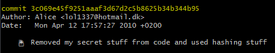
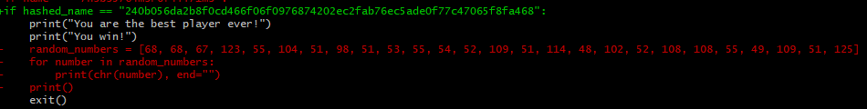

## Cool Story, Bro
> Du sidder i dine forældres kælder og leger rundt med en gammel laptop, du brugte tilbage i 2010. Da var du lige gået i gang med at lære at programmere, og du har fundet dit første programmeringsprojekt igen. Du har godt nok lært meget siden da!
>
>**cool-story-bro.zip**

I zip filen ligger en python fil, et billede og en mappe.

Python filen indeholder et *Choose Your Own Adventure* spil, men ikke noget andet. Billedet bliver brugt i spillet. Det er dog værd at bemærke at mappen er en `.git` mappe.

Derfor kører jeg kommandoen `git log` for at se ændringerne igennem.

Her finder jeg følgende:

Så jeg tilføjer flaget `-p`, så jeg kan se alle ændringerne.
Der finder jeg følgende:

Hvilket jeg prøver at køre i python, hvortil jeg så får flaget:
`DDC{7h3b35764m3r0f4ll71m3}`

